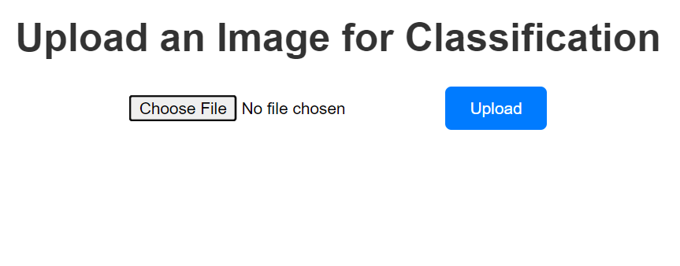
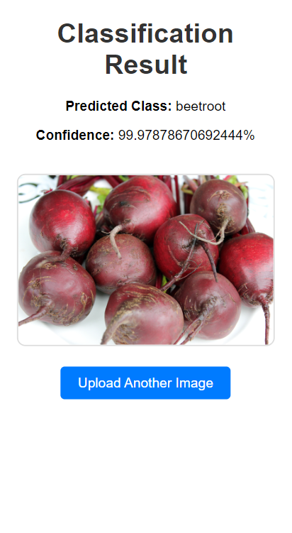
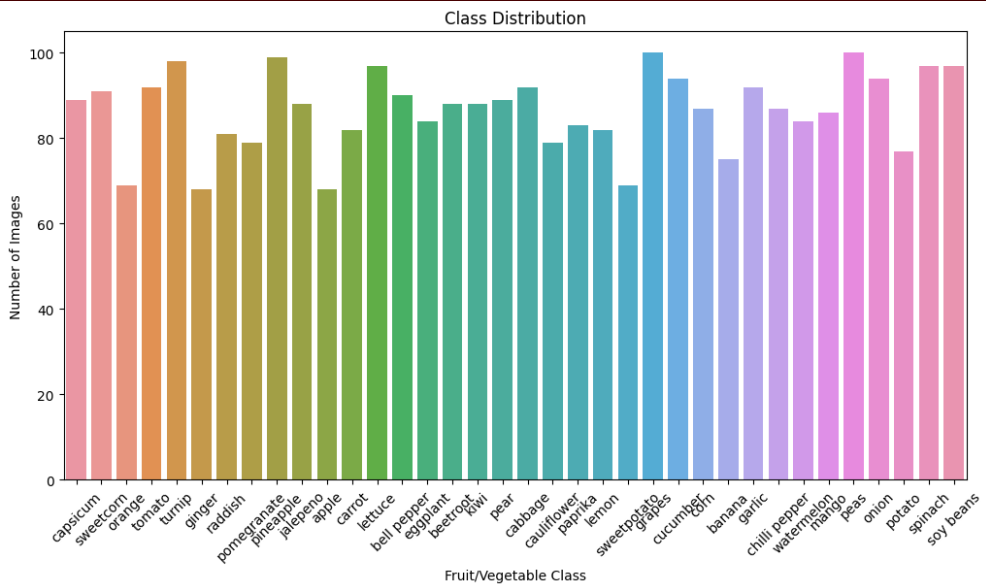
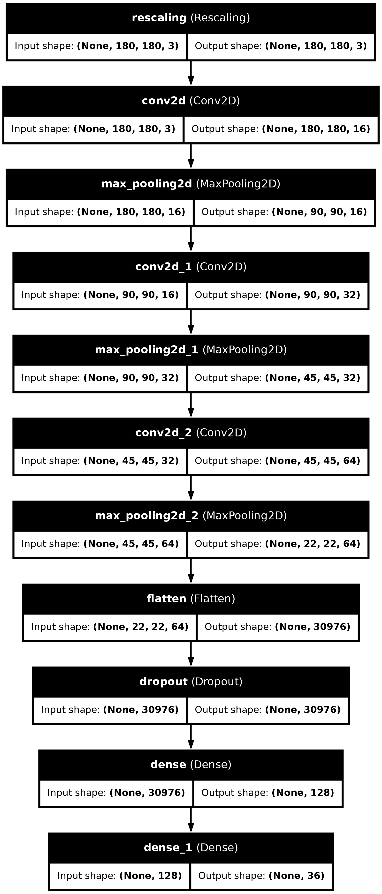
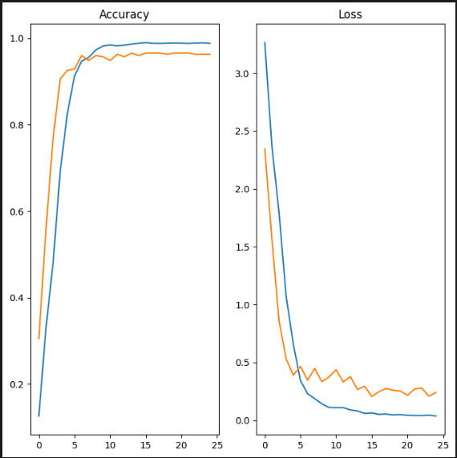

# AgriClassify
## Project Overview

This project is a web-based image classification application built using Flask and TensorFlow. The application leverages a custom-trained model, which I personally developed using a huge database. Users can upload images of fruits or vegetables, and the app will predict the category of the uploaded image, displaying the result along with the prediction confidence.

**Kaggle Link**
https://www.kaggle.com/code/praptiroy025/agriclassify

## Features
- **Image Upload:** Users can upload images directly from their local directory through a web interface.

- **Custom Model Prediction:** The application processes the uploaded image and predicts its category using a TensorFlow model that I personally trained with a large dataset.

- **Result Display:** The predicted category and confidence level are displayed on a results page alongside the uploaded image.

## Project Structure

        project-directory/
        │
        ├── app.py                    
        ├── templates/
        │   ├── result.html            
        │   └── upload.html           
        ├── uploads/                  
        └── README.md                 
## Tech Stack

**Language:** Python

**Backend:** Flask

**Machine Learning:** Pandas, Matplotlib, TensorFlow, Keras

**Frontend:** HTML, CSS

**Deployment:** Flask development server

## Installation

### Prerequisites
Python 3.7+
Pip (Python package installer)

### Setup Instructions

#### Clone the repository:

git clone https://github.com/Roy025/AgriClassify.git

cd AgriClassify

#### Create a virtual environment:
python -m venv venv
venv\Scripts\activate

#### Install the required packages:

<!-- pip install tensorflow flask pillow
pip freeze > requirements.txt -->
pip install -r requirements.txt

### Run the application:
python app.py

### Access the application:
Open your web browser and navigate to http://127.0.0.1:5000/.

### Screenshots:

**Upload**

**Result**

**Data**

**Model Structure**

**Accuracy**

